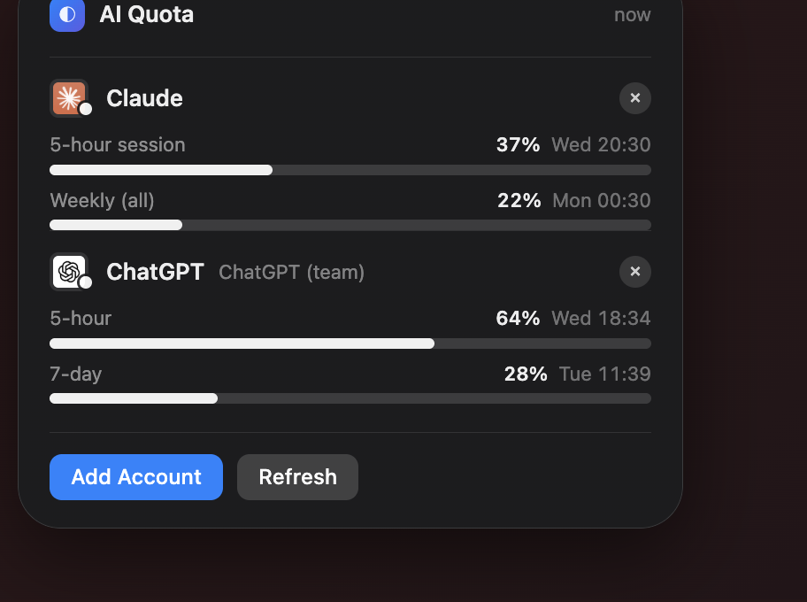

# aiquota

**See how much of every AI subscription you've used — in one place.**

Checking whether you're about to hit a limit means opening Claude's settings,
then ChatGPT's, then whatever else you pay for. `aiquota` puts every quota in
one widget, one menu bar item, and one command.

<p align="center">
  
</p>

```
$ aiquota

Claude  [live]
  5-hour session     █████████░░░░░░░░░░░░░░░  37.0%  resets Wed 20:30
  Weekly (all)       █████░░░░░░░░░░░░░░░░░░░  22.0%  resets Mon 00:30
  binding: five_hour · overage: rejected

ChatGPT  ChatGPT (team)  [live]
  5-hour             ███████████████░░░░░░░░░  64.0%  resets Wed 18:34
  7-day              ███████░░░░░░░░░░░░░░░░░  28.0%  resets Tue 11:39
```

- **Sign in, don't paste keys.** Pick a platform and its own login page opens.
  You choose the account; aiquota never sees a password.
- **No dependencies.** Pure Python stdlib, so `pip install` can't break.
- **Never invents a number.** Every card is tagged `live`, `manual`, or
  `error`. If a provider exposes no counter, it says so instead of showing a
  plausible percentage.
- **Respects provider terms.** Where a provider forbids third-party sign-in,
  aiquota won't offer it — and tells you why, with a link to the policy.

---

## Install

```bash
uv tool install aiquota      # or: pipx install aiquota
aiquota install-widget       # macOS: adds the menu bar + desktop widgets
```

Then click **＋ Add an AI account** in the widget and sign in.

<details>
<summary>Other ways</summary>

```bash
pip install aiquota                 # into the current environment
pip install git+https://github.com/anujpatel06/aiquota   # latest main
```

`uv tool` / `pipx` are recommended because they put `aiquota` on your PATH
without touching your project environments.

The widgets need one of these host apps — `install-widget` tells you which
is missing rather than failing quietly:

```bash
brew install --cask swiftbar    # menu bar
brew install --cask ubersicht   # desktop
```

Install just one with `aiquota install-widget menubar` or `… desktop`.
</details>

Python 3.8+, no dependencies. The CLI runs anywhere; the widgets are macOS
only, and `install-widget` says so instead of pretending on Linux.

## Quick start

```bash
aiquota link      # see what's on your machine, choose what to track
aiquota           # show everything
```

`link` is the only way an account gets connected. It lists credentials it can
see — which account, from which file — and **links nothing until you pick one
and confirm**. Nothing is read or sent before that.

```
$ aiquota link

Add an AI account

Nothing is read until you choose it.

  [1]    ChatGPT / Codex          ● live  ✓ tracked
         Codex/Work windows + credits (NOT general chat quota)
         ✓ found: Codex CLI login (auth_mode: chatgpt), account 2754df98…

  [2]    Claude                   ● live
         Pro/Max 5-hour + weekly windows, reset times
         needs: Claude Code login, or an OAuth token

  [3]    Cursor                   ◐ manual for now
         Request quota is shown in-app; no documented API yet

  [7]    Gemini                   ○ manual
         No consumer quota API; AI Studio shows API-tier limits only

  ... 16 platforms total ...

  [17]   Something else…          ○ manual
         any AI service not listed above

Add which? (number, or Enter to cancel):
```

The badges are honest about what you'll actually get:

| Badge | Meaning |
|---|---|
| `● live` | An adapter fetches real usage once you link a credential |
| `◐ manual for now` | An endpoint likely exists; no adapter written yet — PRs welcome |
| `○ manual` | No usage API exists; you enter the numbers |

Most AI platforms publish no consumer usage API at all. Listing them as
`manual` is deliberate — a browsable list of everything you pay for beats a
short list of only what can be automated.

Useful variants:

```bash
aiquota link --list      # just browse, change nothing
aiquota link cursor      # jump straight to one platform
aiquota unlink chatgpt   # stop using the credential, keep the service
```

## Adding accounts

Click **＋ Add an AI account…** in the menu bar or desktop widget and a native
macOS list appears with every supported platform:

```
●  ChatGPT / Codex  —  live usage  ✓ added
●  Claude           —  live usage  ✓ added
◐  Cursor           —  manual for now
◐  ElevenLabs       —  manual for now
◐  GitHub Copilot   —  manual for now
◐  OpenRouter       —  manual for now
○  Gemini           —  manual entry
○  Grok             —  manual entry
○  Higgsfield       —  manual entry
○  Midjourney       —  manual entry
○  Perplexity       —  manual entry
○  Runway           —  manual entry
○  Suno             —  manual entry
○  v0 / Lovable / Replit …
＋  Something else…
```

Pick one and it walks you through the rest. No terminal required — though
`aiquota link` gives the same flow in the shell if you prefer.

The badges say what you actually get:

| Badge | Meaning |
|---|---|
| `● live` | Real usage, fetched once you link a credential |
| `◐ manual for now` | An endpoint likely exists; no adapter yet — PRs welcome |
| `○ manual` | No usage API; you enter the numbers |

Most AI platforms publish no consumer usage API. Listing them as `manual` is
deliberate — seeing everything you pay for in one place beats seeing only the
two that can be automated.

## Usage

```bash
aiquota                      # status for everything (default command)
aiquota claude               # just one service
aiquota --json               # machine-readable
aiquota --compact            # one line, for a status bar
aiquota --html ~/quota.html  # write a widget
aiquota -r                   # bypass the cache
aiquota doctor               # diagnose configuration problems
```

### Managing services

```bash
aiquota list                       # what you're tracking
aiquota add midjourney --adapter manual --plan "Standard"
aiquota set midjourney credits=120 credits_total=900
aiquota disable chatgpt            # keep config, hide the card
aiquota enable chatgpt
aiquota remove midjourney          # asks first
aiquota rm midjourney -y           # don't ask
aiquota rm a b c -y                # several at once
```

`remove` also purges that service's cache entry, so a deleted card can't
reappear from stale data.

### Tracking a service with no API

Most AI subscriptions expose nothing. Track them anyway — no code required:

```bash
aiquota add higgsfield --adapter manual --plan "Creator" \
    --set credits=420 --set credits_total=1500 --set renews_on=2026-10-01

# or as a used/limit pair with your own unit
aiquota add notebooklm --adapter manual \
    --set used=140 --set limit=900 --set unit_label="Notebooks"
```

These render as `manual`, so you're never fooled into thinking a hand-typed
number was fetched live.

## Supported platforms

How you connect each one depends on what the provider allows.

### Sign in with your account

Click the platform, its own login page opens, you pick the account.
No API key, no password shown to aiquota.

<p align="center">
  
</p>

| Platform | What you get |
|---|---|
| **Cursor** | Request quota for the billing period (sign in) |
| **Grok** | Subscription tier (sign in) |
| **Midjourney** | Fast GPU minutes (sign in) |
| **OpenRouter** | Credit balance and spend (official API) |
| **Perplexity** | Pro search quota (sign in) |
| **Runway** | Credit balance (sign in) |
| **Suno** | Song credits and renewal date (sign in) |

### Uses a credential you already have

These providers restrict third-party sign-in, so aiquota reads a
credential you created yourself — and asks first.

| Platform | Why not sign-in | Source |
|---|---|---|
| **ChatGPT / Codex** | Codex CLI's login is issued to Codex. | [developers.openai.com](https://developers.openai.com/codex/auth) |
| **Claude** | Anthropic restricts OAuth to Claude Code and its own applications. | [code.claude.com](https://code.claude.com/docs/en/legal-and-compliance) |
| **ElevenLabs** | No third-party OAuth; a user-created API key is the supported route. | [elevenlabs.io](https://elevenlabs.io/docs/api-reference/authentication) |
| **GitHub Copilot** | Reuses your existing `gh` CLI login, which you performed yourself. | [docs.github.com](https://docs.github.com/en/copilot) |

### Manual entry

No reachable usage endpoint — probed and confirmed, not assumed.
You enter the numbers and they're labelled `manual`.

**Gemini**, **Higgsfield**, **Lovable**, **Replit**, **v0**.

Anything not listed: choose "Something else…" in the picker.

If you know a real endpoint for a manual entry, that's the most
valuable PR you can send — see [CONTRIBUTING.md](CONTRIBUTING.md).
### Important caveats

Read these before trusting a number.

- **Most of these endpoints are undocumented.** They are the ones each
  vendor's own client calls, and they can change without notice. aiquota has no
  affiliation with any provider listed.
- **Claude prefers a free read.** The adapter calls the read-only
  `/api/oauth/usage` endpoint first. If your token lacks the `user:profile`
  scope (tokens from `claude setup-token` do), it falls back to reading rate
  headers from a 1-token Haiku call and says so in `read_via`. Results are
  cached for 5 minutes — raise `--ttl` if you poll often.
- **ChatGPT covers the Codex/Work meter, not general chat.** Your normal
  conversation quota has no reachable endpoint. Nothing here can show it.
- **ChatGPT Plus ≠ OpenAI API.** Separate products, separate billing. The
  documented `/v1/usage` endpoints report API spend and know nothing about a
  Plus subscription.

### Credentials

**aiquota never uses a credential you haven't linked.** Run `aiquota link` to
see what's available and choose. It will find logins belonging to other apps
(Claude Code, Codex CLI, Hermes) but will not touch them until you say so.

| Adapter | Can link from |
|---|---|
| `claude` | `AIQUOTA_CLAUDE_TOKEN` / `ANTHROPIC_TOKEN` env, `~/.claude/.credentials.json`, `~/.hermes/.env` |
| `chatgpt` | `AIQUOTA_CODEX_TOKEN` env, `~/.codex/auth.json` |

Env vars and tokens you put in the config are used directly — you set those
deliberately. Reading *another application's* credential file always requires
`link` (or `autodiscover=true`). Set `AIQUOTA_NO_AUTODISCOVER=1` to block it
entirely. Config lives at `~/.config/aiquota/config.json`, chmod `0600`.

## Writing an adapter

Drop a `.py` file in `~/.config/aiquota/adapters/` — no fork, no reinstall:

```python
from aiquota import Adapter, Result, Window, register, LIVE

@register
class MyServiceAdapter(Adapter):
    name = "myservice"                    # config key
    service = "My Service"                # display name
    summary = "What this reads"           # shown by `aiquota adapters`
    setup = "Set MYSERVICE_TOKEN"         # shown when unconfigured

    def probe(self, conf):
        return Result(
            name=self.name, service=self.service, tier=LIVE,
            windows=[Window(label="Monthly", used_pct=42.0,
                            resets_at="Nov 1")],
        )
```

Then `aiquota add myservice`. The contract:

- **Never raise.** Catch your errors and return `tier=ERROR` with a readable
  message. A broken adapter must not take down the whole run (there's a test
  for this).
- **Be honest about `tier`** — `LIVE` only for numbers you actually fetched.
- **Declare `cost_note`** if probing spends quota or money.

PRs adding adapters are welcome.

## Scripting

```bash
# warn when any window passes 80%
aiquota --exit-code --threshold 80 || notify-send "AI quota running low"

# tmux status bar
set -g status-right '#(aiquota --compact)'
```

`--json` gives you `{generated_at, services: [{name, service, plan, tier,
windows: [{label, used_pct, resets_at}], extra}]}`.

## Desktop widgets

Keep it on screen instead of typing a command:

- **Menu bar** (SwiftBar/xbar) — `AI 46%` at the top of the screen, over every app
- **Desktop** (Übersicht) — a panel drawn on the wallpaper

Both live in [`widgets/`](widgets/) with install steps.

## Development

```bash
python3 -m unittest discover -s tests -v    # 31 tests, no network, ~0.2s
```

Tests set `AIQUOTA_NO_AUTODISCOVER=1` so they never pick up real credentials.

## License

MIT
